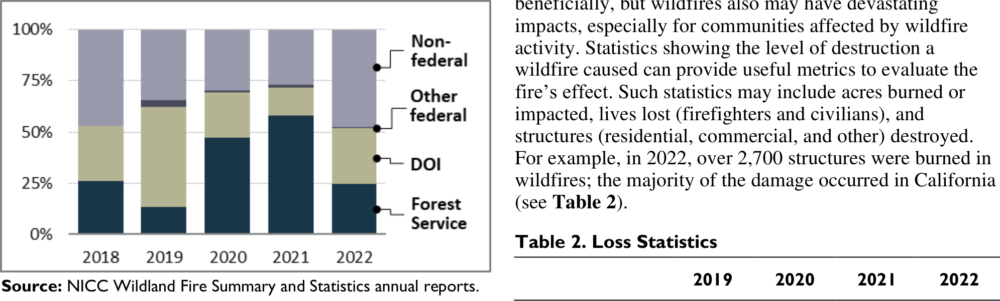

# Wildfire Statistics

Wildfires are unplanned fires, including lightning-caused fires, unauthorized human-caused fires, and escaped fires from prescribed burn projects. States are responsible for responding to wildfires that begin on nonfederal (state, local, and private) lands, except for lands protected by federal agencies under cooperative agreements. The federal government is responsible for responding to wildfires that begin on federal lands. The Forest Service (FS)—within the U.S. Department of Agriculture—carries out wildfire management and response across the 193 million acres of the National Forest System (NFS). The Department of the Interior (DOI) manages wildfire response for more than 400 million acres of national parks, wildlife refuges and preserves, other public lands, and Indian reservations.

Wildfire statistics help illustrate past U.S. wildfire activity. Nationwide data compiled by the National Interagency Coordination Center (NICC) indicate that the number of annual wildfires is variable but has decreased slightly over the last 30 years. The number of acres affected annually, while also variable, generally has increased (see Figure 1). Since 2000, an annual average of 70,025 wildfires have burned an annual average of 7.0 million acres. The acreage figure is more than double the average annual acreage burned in the 1990s (3.3 million acres), although a greater number of fires occurred annually in the 1990s on average (78,600).

## Table 1. Annual Wildfires and Acres Burned

## Figure 1. Annual Wildfires and Acres Burned, 1993-2022

Source: NICC Wildland Fire Summary and Statistics annual reports.

Note: Data reflect wildland fires and acres burned nationwide, including wildland fires on federal and nonfederal lands.

From 2013 to 2022, there were an average of 61,410 wildfires annually and an average of 7.2 million acres impacted annually. In 2022, 68,988 wildfires burned 7.6 million acres. Over 40% of these acres were in Alaska (3.1 million acres).

As of June 1, 2023, around 18,300 wildfires have impacted over 511,000 acres this year.

## Figure 2. Top Five Years with Largest Wildfire Acreage Burned Since 1960

Source: NICC Wildland Fire Summary and Statistics annual reports.

Note: Number of fires in thousands.

The number of fires and acreage burned are indicators of the annual level of wildfire activity. These numbers may not be indicative of fire’s impact on human development or communities, since many fires occur in large, relatively undeveloped areas. Acreage burned also does not indicate the severity of a wildfire, the degree of impact upon forests or soils, or other ecological effects.

Most wildfires are human-caused (89% of the average number of wildfires from 2018 to 2022). Wildfires caused by lightning tend to be slightly larger and to burn more acreage (53% of the average acreage burned from 2018 to 2022) than human-caused fires.

In 2022, 52% of the nationwide acreage burned by wildfires was on federal lands (4.0 million acres; see Table 1), lower than the 10-year average (64%) of impacted federal land acreage. The other 48% of the acreage burned in 2022 was on state, local, or privately owned lands, though the fires on these lands accounted for 83% of total fires. Of the federal acreage burned nationwide in 2022, 52% (2.1 million acres) burned on DOI land and 47% (1.9 million acres) burned on FS land (see Figure 3). The 2022 figures are driven largely by Alaska, where just over half of the acreage impacted occurred on nonfederal lands (1.6 million acres) and just under half was on DOI lands (1.5 million acres).

Source: NICC Wildland Fire Summary and Statistics annual reports.

Note: DOI=Department of the Interior.

More wildfires occur in the East (including the central states), but the wildfires in the West (i.e., Alaska, Arizona, California, Colorado, Idaho, Montana, New Mexico, Nevada, Oregon, Utah, Washington, and Wyoming) are larger and burn more acreage. In 2022, just over 20,000 wildfires burned approximately 5.8 million acres in the West, compared with the over 48,000 fires that burned just over 1.8 million acres in the East. In the East (where there is less federal acreage), most of the fires occur on nonfederal lands; in the West, most of the fires occur on federal lands (see Figure 4). In 2022, 85% (1.5 million acres) of the acreage burned in the East was on nonfederal land, whereas 64% (3.7 million acres) of the acreage burned in the West was on federal land.

Source: NICC Wildland Fire Summary and Statistics annual reports.

Notes: West: AK, AZ, CA, CO, ID, HI, MT, NM, NV, OR, UT, WA, and WY. East: All other states and Puerto Rico.

Resources

Another metric useful for assessing wildfire activity is the extent to which nationwide resources—including personnel and equipment—are engaged in wildfire suppression. A proxy for resource commitments is the nationwide Preparedness Level (PL) scale, which ranges from 1 (lowest) to 5 (highest). The higher PLs indicate significant commitment of shared resources. In 2022, the nationwide level was 4 for 10 days and never reached the highest level (5). In contrast, the highest level was reached for 68 days in 2021, the longest since at least 2000.

Wildfire Damages

Wildfires may affect certain ecological resources beneficially, but wildfires also may have devastating impacts, especially for communities affected by wildfire activity. Statistics showing the level of destruction a wildfire caused can provide useful metrics to evaluate the fire’s effect. Such statistics may include acres burned or impacted, lives lost (firefighters and civilians), and structures (residential, commercial, and other) destroyed. For example, in 2022, over 2,700 structures were burned in wildfires; the majority of the damage occurred in California (see Table 2). 

Table 2. Loss Statistics

|          | 2019 | 2020  | 2021 | 2022  |
|----------|------|-------|------|-------|
| Structures Burned | 963  | 17,904 | 5,972 | 2,717 |
| % Residences       | 43%  | 64%   | 60%  | 46%  |

Source: NICC Wildland Fire Summary and Statistics annual reports.

Conflagrations

Of the 1.6 million wildfires that have occurred since 2000, 254 exceeded 100,000 acres burned and 16 exceeded 500,000 acres burned. A small fraction of wildfires become catastrophic, and a small percentage of fires accounts for the vast majority of acres burned. For example, about 1% of wildfires become conflagrations—raging, destructive fires—but predicting which fires will “blow up” into conflagrations is challenging and depends on a multitude of factors, such as weather and geography. There have been 1,041 large or significant fires annually on average from 2018 through 2022. In 2022, 2% of wildfires were classified as large or significant (1,239); 45 exceeded 40,000 acres in size, and 17 exceeded 100,000 acres. For context, there were fewer large or significant wildfires in 2021 (943) but more in 2017 (1,409).

Issues for Congress

Issues Congress may consider include the strategies and resources used for wildfire prevention, mitigation, and management, as well as wildfires’ impact on both the quality of life and the economic communities affected by wildfire activity. Other issues relate to post-wildfire recovery and site restoration. Congress also considers the total federal cost of wildfire management, including the cost of suppression operations; these costs vary annually and are difficult to predict.

Katie Hoover, Specialist in Natural Resources Policy Laura A. Hanson, Senior Research Librarian

IF10244

## Disclaimer

This document was prepared by the Congressional Research Service (CRS). CRS serves as nonpartisan shared staff to congressional committees and Members of Congress. It operates solely at the behest of and under the direction of Congress. Information in a CRS Report should not be relied upon for purposes other than public understanding of information that has been provided by CRS to Members of Congress in connection with CRS's institutional role. CRS Reports, as a work of the United States Government, are not subject to copyright protection in the United States. Any CRS Report may be reproduced and distributed in its entirety without permission from CRS. However, as a CRS Report may include copyrighted images or material from a third party, you may need to obtain the permission of the copyright holder if you wish to copy or otherwise use copyrighted material.

https://crsreports.congress.gov | IF10244 · VERSION 68 · UPDATED
